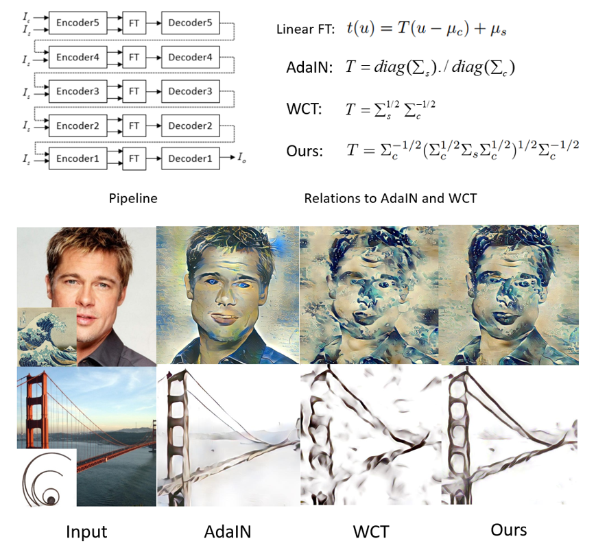

Code for A Closed-form Solution to Universal Style Transfer (https://arxiv.org/abs/1906.00668) - ICCV2019
=============

This work mathematically derives a closed-form solution to universal style transfer. It is based on the theory of optimal transport and is closed related to AdaIN and WCT. AdaIN ignores the correlation between channels and WCT does not minimize the content loss. We consider both of them. Details of the derivation can be found in the paper.




## Acknowledgments

Link to AdaIN : https://github.com/xunhuang1995/AdaIN-style

Link to WCT : https://github.com/Yijunmaverick/UniversalStyleTransfer

## Usage

1. Install Torch from http://torch.ch/

2. Download encoders, decoders from [here](https://drive.google.com/open?id=1uv1m15RqTwgWQog7BMAW38bDVE7BkzO4) and unzip it to models/

3. For single image usage, see demo.sh

4. For folder images usage, see demo_folder.sh


## Citation

If you find this code useful in your research, please consider to cite the following paper:

```
@article{lu2019optimal,
  title={a closed-form solution to universal style transfer},
  author={Ming Lu, Hao Zhao, Anbang Yao, Yurong Chen, Feng Xu, Li Zhang},
  journal={ICCV 2019},
  year={2019}
}
```

## Contemporary Works

I recently find two contemporary works (same conclusions), please also consider to cite them.

```
@inproceedings{li2019optimal,
  title={Optimal Transport of Deep Feature for Image Style Transfer},
  author={Li, Pan and Zhao, Lei and Xu, Duanqing and Lu, Dongming},
  booktitle={Proceedings of the 2019 4th International Conference on Multimedia Systems and Signal Processing},
  pages={167--171},
  year={2019},
  organization={ACM}
}
```

```
@article{mroueh2019wasserstein,
  title={Wasserstein Style Transfer},
  author={Mroueh, Youssef},
  journal={arXiv preprint arXiv:1905.12828},
  year={2019}
}
```


